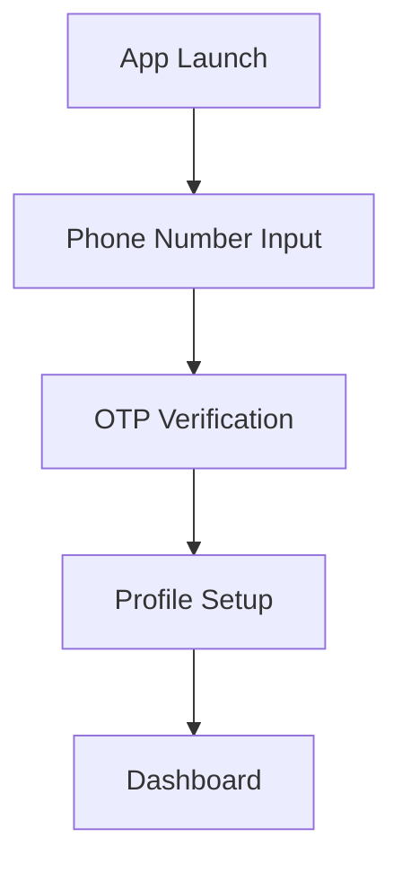
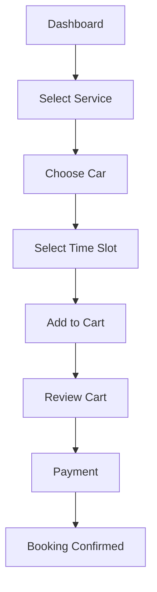

# CarsNan User App - Complete Specification & Implementation Guide

## 📱 Overview
The CarsNan User App is a premium car washing service booking application built with Flutter, following Clean Architecture and MVVM patterns. Users can book services, manage cars, track orders, and provide feedback.

## 🏗️ Current Implementation Status

### ✅ Completed Features

#### 1. Authentication System
- **Phone Authentication**: Firebase-based OTP verification
- **Email Authentication**: Email/password sign-in
- **Multi-Factor Authentication (MFA)**: Enhanced security
- **Test Phone Numbers**: Configured for development testing
- **User Profile Management**: Complete profile system

**Key Files:**
- `lib/features/authentication/`
- Firebase integration with proper error handling
- Secure credential management

#### 2. Dashboard & Services
- **Premium UI Theme**: Black and gold luxury design
- **Service Cards**: General ($29.99), Premium ($59.99), Luxury ($129.99)
- **Service Details**: Comprehensive service information
- **Responsive Design**: Works across all screen sizes

**Key Components:**
- `lib/features/dashboard/`
- Three service tiers with dynamic pricing
- Service selection and details modal

#### 3. Car Management System
- **Add New Cars**: Complete validation and form handling
- **Car Types**: Sedan, SUV, Mini with dynamic pricing multipliers
- **Default Car Selection**: Auto-selection for bookings
- **CRUD Operations**: Add, view, edit, delete cars
- **Demo Data**: 3 sample cars for testing

**Features:**
- Car type-based pricing (SUV +20%, Mini -20%, Sedan 1x)
- Form validation and error handling
- Responsive car management interface

#### 4. Shopping Cart System
- **Add to Cart**: Service + car combinations
- **Dynamic Pricing**: Real-time price calculations
- **Cart Management**: View, edit, remove items
- **Persistent Storage**: Cart data persistence
- **Time Slot Selection**: Scheduling integration

**Advanced Features:**
- Reactive UI with live updates
- Cart icon with item count badge
- Addon products integration
- Checkout flow with validation

#### 5. Address Management
- **Multiple Addresses**: Add, edit, delete addresses
- **Default Address**: Set preferred address
- **Location Services**: GPS integration
- **Address Validation**: Complete form validation

#### 6. Order History & Tracking
- **Booking Management**: View all bookings
- **Order Status**: Real-time status updates
- **Order Details**: Comprehensive booking information
- **Service Completion**: Track service progress

#### 7. Profile Management
- **User Information**: Complete profile management
- **Settings**: App preferences and configurations
- **Account Management**: Profile updates and preferences

### 🔄 Partially Implemented

#### 1. Firebase Integration
- **Firestore Database**: User data, bookings, services
- **Authentication**: Complete Firebase Auth setup
- **Storage**: Firebase Storage for images
- **Real-time Updates**: Live data synchronization

**Status**: Core integration complete, some features need enhancement

#### 2. Time Slot Management
- **Slot Selection**: Time slot booking interface
- **Availability**: Real-time slot availability
- **Scheduling**: Integration with booking system

**Status**: UI implemented, needs backend integration

### 🔲 Missing/Incomplete Features

#### 1. Payment Gateway Integration
**Priority**: HIGH - Critical for production

**Requirements:**
- **Payment Methods**: Credit/Debit cards, UPI, Wallets
- **Secure Processing**: PCI DSS compliance
- **Payment Status**: Real-time payment tracking
- **Receipt Generation**: Digital receipts

**Implementation Needed:**
```yaml
Payment Gateway Options:
  - Stripe Integration
  - Razorpay (India-specific)
  - PayPal
  - Google Pay/Apple Pay

Required Features:
  - Payment form with card details
  - OTP verification for payments
  - Payment success/failure handling
  - Refund processing capability
```

#### 2. Push Notifications
**Priority**: MEDIUM

**Requirements:**
- **Order Updates**: Service status notifications
- **Promotional**: Marketing and offers
- **Reminders**: Booking reminders
- **Worker Updates**: Service completion alerts

#### 3. Reviews & Ratings System Enhancement
**Priority**: MEDIUM

**Current Status**: Basic implementation exists
**Needs Enhancement:**
- Photo uploads with reviews
- Review moderation system
- Rating analytics
- Response to reviews

#### 4. Real-time Location Tracking
**Priority**: HIGH for premium services

**Requirements:**
- **Worker Location**: Track worker en route
- **ETA Updates**: Real-time arrival estimates
- **Geofencing**: Service area validation
- **Live Tracking**: Google Maps integration

#### 5. In-App Chat/Support
**Priority**: MEDIUM

**Requirements:**
- **Customer Support**: Live chat functionality
- **Worker Communication**: Direct messaging
- **Issue Reporting**: Bug reporting system
- **FAQ Section**: Self-help resources

## 🛠️ Technical Architecture

### Current Tech Stack
```yaml
Framework: Flutter 3.8.1+
Language: Dart
Architecture: Clean Architecture + MVVM
State Management: flutter_bloc (Cubit/Bloc)
Dependency Injection: get_it + injectable
Navigation: go_router
Database: Firebase Firestore
Authentication: Firebase Auth
Storage: Firebase Storage
Local Storage: Hive (for offline data)
Code Generation: freezed, json_serializable
```

### Project Structure
```
lib/
├── app.dart                 # App configuration
├── main.dart               # App entry point
├── theme.dart              # Theme configuration
├── core/                   # Shared functionality
│   ├── constants/          # App constants
│   ├── di/                 # Dependency injection
│   ├── errors/             # Error handling
│   ├── router/             # Navigation setup
│   ├── services/           # Core services
│   └── utils/              # Utility functions
└── features/               # Feature modules
    ├── authentication/     # Auth system
    ├── dashboard/          # Home dashboard
    ├── car/               # Car management
    ├── cart/              # Shopping cart
    ├── address/           # Address management
    ├── profile/           # User profile
    └── home/              # Main navigation
```

## 📱 User Journey & Features

### 1. Onboarding & Authentication


### 2. Service Booking Flow


### 3. Service Management
- **Active Bookings**: View ongoing services
- **History**: Past service records
- **Tracking**: Real-time service status
- **Feedback**: Post-service reviews

## 🎨 UI/UX Features

### Design System
- **Color Scheme**: Premium black and gold
- **Typography**: Clean, modern fonts
- **Material 3**: Latest design guidelines
- **Responsive**: Adapts to all screen sizes

### Key UI Components
- **Service Cards**: Elegant service presentation
- **Car Selection**: Interactive car chooser
- **Time Slots**: Calendar-based slot picker
- **Cart Interface**: Shopping cart with live updates
- **Status Tracking**: Visual service progress

## 🔗 Firebase Integration

### Current Implementation
```yaml
Services Used:
  - Firebase Authentication
  - Cloud Firestore (Database)
  - Firebase Storage (Images)
  - Firebase Analytics (Optional)

Data Structure:
  users/
    └── {userId}/
        ├── profile/          # User profile data
        ├── cars/            # User vehicles
        ├── addresses/       # User addresses
        └── bookings/        # Service bookings

  services/                  # Available services
  workers/                   # Worker information
  reviews/                   # Service reviews
```

## 📋 Implementation Priorities

### Phase 1: Payment Integration (Immediate)
1. **Choose Payment Gateway**: Stripe or Razorpay
2. **Implement Payment Flow**: Card processing
3. **Add Payment UI**: Secure payment forms
4. **Handle Payment States**: Success/failure handling
5. **Generate Receipts**: Digital receipt system

### Phase 2: Real-time Features (Short-term)
1. **Push Notifications**: Order status updates
2. **Live Tracking**: Worker location tracking
3. **Real-time Chat**: Customer support
4. **Status Updates**: Live service progress

### Phase 3: Advanced Features (Medium-term)
1. **Advanced Analytics**: Usage tracking
2. **Loyalty Program**: Reward system
3. **Referral System**: User referrals
4. **Multi-language**: Localization support

### Phase 4: Performance & Scale (Long-term)
1. **Performance Optimization**: App speed
2. **Offline Support**: Offline functionality
3. **API Optimization**: Efficient data loading
4. **Security Enhancements**: Advanced security

## 🧪 Testing Strategy

### Current Testing
- **Unit Tests**: Business logic testing
- **Widget Tests**: UI component testing
- **Integration Tests**: End-to-end flows

### Testing Coverage
```yaml
Authentication: ✅ Comprehensive
Car Management: ✅ Complete
Cart System: ✅ Full coverage
Dashboard: ✅ UI & logic tests
Payment: ❌ Needs implementation
```

## 🚀 Production Readiness

### Ready for Production
- Authentication system
- Car management
- Service browsing
- Cart functionality
- User profiles
- Basic booking flow

### Needs Implementation
- Payment processing
- Real-time notifications
- Advanced tracking
- Customer support features

## 📖 Development Guidelines

### Code Standards
- Follow Clean Architecture principles
- Use dependency injection
- Implement proper error handling
- Write comprehensive tests
- Follow Flutter/Dart best practices

### State Management
- Use Cubit for simple state
- Use Bloc for complex event-driven state
- Implement proper state lifecycle
- Handle loading and error states

### Data Management
- Implement repository pattern
- Use Firebase for real-time data
- Cache data locally with Hive
- Handle offline scenarios

## 🔄 Integration Points

### Admin App Integration
- Service management updates
- Worker assignment data
- Analytics data collection
- System configuration changes

### Worker App Integration
- Job assignments
- Status updates
- Location tracking
- Communication systems

## 📝 Notes for Development

### Key Considerations
1. **Security**: Implement proper authentication & authorization
2. **Performance**: Optimize for smooth user experience
3. **Scalability**: Design for growth and user base expansion
4. **Maintainability**: Follow clean code principles
5. **User Experience**: Focus on intuitive, smooth interactions

### Best Practices
1. Always validate user input
2. Handle network failures gracefully
3. Implement proper loading states
4. Provide clear error messages
5. Maintain consistent UI patterns
6. Test on various devices and screen sizes

---

*This document serves as the complete specification for the CarsNan User App. Use it as a reference for development, testing, and maintenance activities.*
